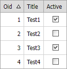

<!-- default badges list -->

<!-- default badges end -->

# Grid View for ASP.NET Web Forms - How to use ASPxCheckBox to update a Boolean field in a DataItem template

This example demonstrates how to use [ASPxCheckBox](https://docs.devexpress.com/AspNet/DevExpress.Web.ASPxCheckBox) to implement inline editing for boolean-type fields in [DataItemTemplate](https://docs.devexpress.com/AspNet/DevExpress.Web.GridViewDataColumn.DataItemTemplate).

The example uses XPO for demonstration purposes only. To use the example with real databases, modify the [ASPxCallback.Callback](https://docs.devexpress.com/AspNet/DevExpress.Web.ASPxCallback.Callback) event handler where you update the required record in the "UPDATE" query.

## Files to Review

* [Default.aspx](./CS/WebSite/Default.aspx) (VB: [Default.aspx](./VB/WebSite/Default.aspx))
* [Default.aspx.cs](./CS/WebSite/Default.aspx.cs) (VB: [Default.aspx.vb](./VB/WebSite/Default.aspx.vb))
* [MyObject.cs](./CS/WebSite/App_Code/MyObject.cs) (VB: [MyObject.vb](./VB/WebSite/App_Code/MyObject.vb))
* [XpoHelper.cs](./CS/WebSite/App_Code/XpoHelper.cs) (VB: [XpoHelper.vb](./VB/WebSite/App_Code/XpoHelper.vb))

## Documentation

* [Access Controls in Templates on the Server](https://docs.devexpress.com/AspNet/403575/common-concepts/access-controls-in-templates-on-the-server)

## More Examples

* [Grid View for ASP.NET Web Forms - How to use template editors to update grid data](https://github.com/DevExpress-Examples/asp-net-web-forms-grid-use-template-editors-to-update-data-on-callbacks)
